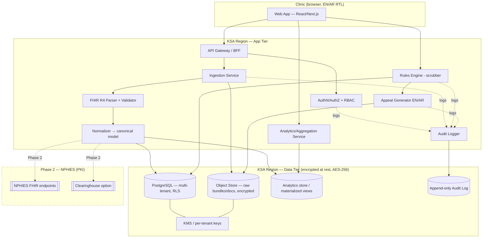

# 02 — Product & Build Plan
### KSA Denial-Management SaaS ("working name: *Rafd* — Arabic رفض, 'denial')

> Companion to `01_market_and_gtm.md`. This file is the engineering/product design.
> Sections **4 (KSA region), 5 (NPHIES path), 6 (compliance), 10 (hosting cost)** carry researched, cited facts. The rest is design.
> Confidence tags on external claims: **(H/M/L)**. Unverified items marked `UNVERIFIED`.

---

## 1. MVP Scope

**Thesis:** Sell provable cash recovery without first solving live NPHIES integration. The wedge is *analytics + scrubbing + appeal generation on data the clinic already has*. Defer real-time NPHIES transactions.

### In scope (MVP / v1)
| Module | What it does | Why first |
|---|---|---|
| **1. Ingest** | Upload/import NPHIES `ClaimResponse` + `Claim` FHIR R4 bundles (JSON), plus CSV/Excel remittance exports and PDF EOB fallback. Parse, normalize, store. | No PKI needed. Clinic can export from their HIS/PMS or clearinghouse portal. Fastest path to first value. |
| **2. Denial analytics** | Dashboards: denial rate by payer, branch, provider, CPT/SBS code, denial reason (CARC/RARC-equivalent). Trend lines. Money-at-risk counter. | This is the "wow" demo. Pure read-side. Proves the problem in their own numbers. |
| **3. Pre-submission scrubber** | Rules engine flags claims likely to deny BEFORE submission: missing pre-auth, code/gender/age mismatch, payer-specific rules, eligibility gaps, bundling/NCCI-style edits adapted to SBS. | Moves from "diagnose" to "prevent" — recurring value, stickiness. |
| **4. Appeal generator** | Auto-draft appeal/reconsideration letters (EN/AR) per denial reason, pulling claim context + payer template + supporting-doc checklist. Human reviews, exports PDF/submits manually. | Converts insight → recovered cash, the headline ROI metric. |
| **5. Recovery tracking** | Mark appeals submitted/won/lost; track recovered SAR. Feeds the ROI dashboard the sales motion promises. | Closes the proof loop. CAC justification. |

### Explicitly deferred (post-MVP)
- Live NPHIES PKI integration / direct claim submission (Phase 2 — see §5).
- Real-time eligibility checks against payers.
- Full HIS/EMR write-back.
- Mobile app (responsive web only at MVP).
- ML-based denial prediction (start rules-based; collect labeled data for later models).

### MVP success definition
A design-partner clinic uploads 3–6 months of historical remittances → sees denial analytics in <10 min → runs scrubber on a live batch → generates ≥1 appeal → recovers measurable SAR within the pilot. ROI provable from their own data.

---

## 2. Roadmap — CREATE → IMPLEMENT → EXECUTE → DEPLOY

| Phase | Goal | Key deliverables | Exit criteria |
|---|---|---|---|
| **CREATE** (wks 1–3) | De-risk data + rules. | FHIR R4 parser for `Claim`/`ClaimResponse`; canonical internal data model; synthetic + 1 real (de-identified) remittance sample parsed; denial-reason taxonomy mapped (CARC/RARC ↔ NPHIES adjudication codes); rules-engine spike. | Parse a real NPHIES `ClaimResponse` bundle → normalized rows in DB. Denial taxonomy reviewed by a KSA RCM SME. |
| **IMPLEMENT** (wks 4–8) | Build the 5 MVP modules. | Multi-tenant app; ingest pipeline (file upload + validation); analytics dashboards; rules engine v1 (10–20 high-value rules); appeal generator with EN/AR templates; audit logging; RBAC. | All 5 modules functional on synthetic data; EN/AR UI; tenant isolation verified; audit trail on every PHI access. |
| **EXECUTE** (wks 9–12) | Prove it with a real clinic. | Design-partner onboarding; load their real historical data; tune rules to their top payers; generate real appeals; recovery tracking live. | ≥1 design partner live; analytics reflect their real denials; ≥1 appeal generated & submitted; recovered-SAR counter moving. |
| **DEPLOY** (wks 12+) | Production-harden in KSA region. | KSA-region hosting (see §4/§10); CI/CD; monitoring/alerting; encryption-at-rest verified; PDPL data-residency posture documented; backup/DR; pen-test. | Running in a KSA cloud region; security review passed; SLA monitoring live; second pilot onboardable self-serve-ish. |

---

## 3. Architecture

### Principles
- **Multi-tenant, row-level isolated** (tenant_id on every row + enforced at query layer). Per-tenant encryption keys for PHI columns.
- **FHIR R4 as the ingest contract**, normalized to an internal relational model for analytics (FHIR is great for exchange, poor for aggregation — don't query raw bundles).
- **Rules engine decoupled** from app code — rules as data (JSON/DSL), versioned, editable without redeploy.
- **Bilingual (EN/AR) first-class** — i18n + RTL from day one, not retrofitted.
- **Audit-everything** — every PHI read/write/export logged immutably (PDPL + clinical trust).



### Component notes
- **Ingestion Service**: accepts FHIR JSON bundles, CSV/XLSX, PDF (OCR fallback). Validates against FHIR R4 + NPHIES profiles (StructureDefinitions from the IG — see §5). Quarantines malformed input.
- **Normalizer**: maps FHIR resources → canonical entities (§7). One row per claim line; denial reasons exploded to queryable rows.
- **Rules Engine**: condition→flag rules over normalized claims. Rules versioned per tenant + global library. Outputs a risk score + reasons per claim pre-submission.
- **Appeal Generator**: template engine keyed on denial reason + payer; merges claim/clinical context; bilingual output; never auto-submits at MVP (human-in-the-loop).
- **Analytics**: materialized views / rollups for sub-second dashboards; never aggregate over raw FHIR.

---

## 4. Stack + Repo Structure  *(KSA-region claims in §10 — RESEARCH-backed)*

### Stack + rationale
| Layer | Choice | Rationale |
|---|---|---|
| Frontend | **Next.js (React) + TypeScript**, Tailwind, RTL-aware component lib | SSR for fast dashboards; mature i18n/RTL; one language across stack; large KSA dev talent pool. |
| API | **Next.js route handlers / Node (NestJS optional) TypeScript** | Shared types with FE; fast iteration; fits a lean team. |
| Rules engine | **JSON-rule DSL evaluated in-process** (json-rules-engine style) | Rules-as-data, versionable, no redeploy; transparent/auditable for clinical sign-off vs. opaque ML. |
| DB | **PostgreSQL** (managed, KSA region) + Row-Level Security | Strong relational analytics, RLS for tenant isolation, JSONB for raw FHIR, mature encryption. |
| Object store | **S3-compatible in KSA region**, SSE AES-256 | Raw bundles, generated appeal PDFs, supporting docs. |
| Auth | **OIDC (managed, KSA-resident) + app-level RBAC** | Standards-based; per-tenant roles; audit hooks. |
| FHIR | **HL7 FHIR R4 libs** (e.g. `@types/fhir`, HAPI for validation if JVM tooling used) | Validate against NPHIES profiles. |
| Infra | **Terraform/IaC**, containers, managed K8s or serverless containers in KSA region | Reproducible, region-pinned, auditable. |

> **Cloud / KSA region (RESEARCH — updated 2026-07-01):** PDPL data sovereignty means we host **in-Kingdom**. 🆕 **An in-Kingdom hyperscaler region is LIVE today: Oracle Cloud Infrastructure "Saudi Arabia Central (Riyadh)", region id `me-riyadh-1`, GA since 6 Aug 2024 — CONFIRMED (3-0)** ([Oracle](https://www.oracle.com/sa/cloud/cloud-regions/riyadh/)). This overturns the prior "no Oracle KSA region confirmed" note (the Insta-on-Oracle-Cloud hint *did* point at a real in-Kingdom region). **AWS (me-central-2 / "Saudi Arabia")** — announced >$5.3B, **planned 2026, NOT yet GA** ([AWS press](https://press.aboutamazon.com/2024/3/aws-to-launch-an-infrastructure-region-in-the-kingdom-of-saudi-arabia), [Regions & AZs](https://aws.amazon.com/about-aws/global-infrastructure/regions_az/)). **Azure "Saudi Arabia East"** = **Q4 2026, not yet live** ([Microsoft, Feb 2026](https://news.microsoft.com/source/emea/2026/02/microsoft-confirms-saudi-arabia-datacenter-region-available-for-customers-to-run-cloud-workloads-from-q4-2026/)). Google in-Kingdom region still unconfirmed.
>
> **Decision (updated):** an in-Kingdom region no longer blocks launch — **Oracle Cloud Riyadh (`me-riyadh-1`) is the confirmed-GA in-Kingdom host available now**; use it as the MVP target or interim host until AWS KSA goes GA (2026). Keep infra cloud-portable (Terraform, containers, Postgres, S3-compatible object store) so AWS KSA / Azure KSA (Q4 2026) stay swappable. Validate Oracle service coverage + pricing for the stack. Hosting cost: **§10**.

### Repo structure (monorepo)
```
rafd/
├─ apps/
│  ├─ web/                 # Next.js app (EN/AR RTL), dashboards, upload UI
│  └─ api/                 # API/BFF (if split from web)
├─ packages/
│  ├─ fhir/                # FHIR R4 parsing + NPHIES profile validation
│  ├─ normalizer/          # FHIR → canonical model mappers
│  ├─ rules-engine/        # DSL + evaluator + rule library
│  ├─ appeals/             # template engine + EN/AR templates
│  ├─ db/                  # schema, migrations, RLS policies, seed
│  ├─ audit/               # audit logging lib
│  └─ shared/              # types, i18n, utils
├─ infra/                  # Terraform (KSA region), CI/CD, monitoring
├─ test/
│  ├─ synthetic-fhir/      # synthetic NPHIES bundles + generators
│  └─ e2e/
└─ docs/                   # data model, runbooks, compliance posture
```

---

## 5. NPHIES Integration Path  *(RESEARCH — cited from NPHIES IG + secondary sources)*

> **Phase 1 (MVP): file ingestion, no certificate.** Clinic exports `Claim`/`ClaimResponse`/remittance from HIS/clearinghouse → upload. Zero NPHIES credentials, zero PKI, fastest to value.
>
> **Phase 2: live integration.** Requires formal NPHIES onboarding.

### The standard (verified, H)
- NPHIES is **HL7 FHIR R4 (4.0.1) only**, governed by the **Healthcare Financial Services Implementation Guide, Edition 1 v1.0.0** (package `nphies-fs#1.0.0`, generated 2025-12-03), with SHALL/SHOULD/MAY conformance ([NPHIES IG — Conformance](https://portal.nphies.sa/ig/conformance.html), [Introduction](https://portal.nphies.sa/ig/introduction.html)).
- Transactions to support: **eligibility, pre-authorization, claim submission, payment notification** ([NPHIES IG](https://portal.nphies.sa/ig/introduction.html)). Build & validate against the published **StructureDefinitions/profiles** in the IG.
- Coding the parser/scrubber must understand: **ICD-10-AM (10th Ed)** diagnoses, **SBS** procedures (SBSCS — **V3.0 effective 1 Jan 2026**), LOINC 2.65 labs, SFDA/GTIN pharma ([CHI Uniplat](https://www.chi.gov.sa/en/Uniplat/pages/default3.aspx)).

### Onboarding path (updated 2026-07-01 — vendor track confirmed; exact steps still a call)
A new provider/vendor progresses through **training → clinical readiness → technical readiness → integration → certification** before transacting on the **NPHIES production environment**. 🆕 **Confirmed (2nd research pass):** NPHIES runs an official **"System Vendor Certification Program"** — a dedicated vendor onboarding/certification track (incl. a "Vendor Certification and Onboarding" curriculum + FHIR training) that **software vendors complete themselves**, and **PKI is issued per-organization** ([getcirrus](https://www.getcirrus.com/en-blog/nphies-for-hospitals-and-clinics-in-saudi-arabia)). ⚠️ The exact **PKI issuance mechanics** and **sandbox/conformance test procedure** are still **not on a primary page** (NPHIES IG intro + conformance pages are silent on B1/B2) — **UNVERIFIED (M); confirm via the NPHIES portal / CHI onboarding team before planning Phase 2.**

🆕 **Third pass (2026-07-02) — the gate is now LOCATED and entry is self-serve:**
- Detailed onboarding/PKI/sandbox docs are **NPHIES-Academy-gated, not secret**: the **["System Vendors Onboarding Course"](https://v-academy.nphies.sa/courses/11/system-vendors-onboarding-course?lang=en)** is **mandatory for the vendor certification program** (itself a requirement to link with the platform), and **["Registering in nphies Platform"](https://academy.nphies.sa/courses/6/registering-in-nphies-platform?lang=en)** lists **13 attachment PDFs incl. "nphies Registration Guide V1.3 - English" + "nphies Readiness & Activation Guide V1.2 - English"** (downloads unlock after free Academy registration; the vendor course is a **39-lesson mandatory program**). → **Action: self-enroll (free) before emailing anyone — likely answers most of B1/B2.**
- **Official onboarding contact: `onboarding@chi.gov.sa` / ☎ 920033808** ([NPHIES Academy FAQ](https://academy.nphies.sa/page/7/%D8%A7%D9%84%D8%A3%D8%B3%D8%A6%D9%84%D8%A9-%D8%A7%D9%84%D8%B4%D8%A7%D8%A6%D8%B9%D8%A9?lang=en)); variant `onboarding@cchi.gov.sa` + call center 920004299 (CHI public-provider onboarding PDF); platform support `support@nphies.sa`. Scope-question email drafted → `HUMAN_CONFIRMATION_NEEDED.md` "Emails to send", Email 2.
- ⚠️ **Reported vendor prerequisite:** system vendors must maintain an **official office inside Saudi Arabia** (nphies.sa FAQ content — verify on the call). **Affects Phase-2 company-setup timeline.**

### Clearinghouse vs. direct *(updated 2026-07-01 — B3 resolved; the "clearinghouse offloads B1/B2" assumption is NOT confirmed)*
- **B3 resolved (✅):** NPHIES permits **direct** HIS-to-NPHIES integration **OR** a clearinghouse — **a clearinghouse is NOT mandatory** (Cirrus + NPHIES IG intro doesn't prohibit direct).
- **⚠️ Key correction:** the earlier "clearinghouse = less PKI/conformance lift" was **not verified and is partially contradicted.** **Waseel Connect's pages are silent (3-0)** on whether routing through it removes a vendor's own **PKI cert (B1)** or **conformance testing (B2)**; PKI is **per-organization**; and NPHIES runs its **own vendor-certification program**. So a clearinghouse may **not** offload B1/B2 for a software vendor — do not assume it does.
- **Direct:** integrate our backend straight to NPHIES FHIR endpoints (own the PKI, conformance, profile validation). Max control, more onboarding burden.
- **Clearinghouse:** route via an existing connected intermediary (e.g., **Waseel** — [waseel.com/connect](https://waseel.com/connect/), **Basic SAR 1,499/mo ≤500 txns · Premium SAR 1,999/mo ≤1,500 · Enterprise quote**, confirmed primary). Faster to live + per-transaction cost + dependency — **but confirm it actually carries the NPHIES-side cert for your transactions vs. you still vendor-certifying.**
- **Recommendation:** **Phase 1 = neither** (file ingestion, zero NPHIES creds — fastest value). **Phase 2 = get Waseel's exact scope on a call** (does Connect offload your B1/B2, or not?) **before** choosing clearinghouse-first vs. direct. *Decision gate: Waseel integration-scope answer + confirmed vendor-certification burden.*

---

## 6. Compliance & Security  *(RESEARCH — cited PDPL/SFDA; CBAHI flagged)*

**Engineering baseline (design):** in-Kingdom data residency, **AES-256 at rest** + TLS 1.2+ in transit, app-level **RBAC**, immutable **audit trails** on every PHI access, **per-tenant key separation** (KMS), least-privilege, PHI minimization, no PHI in logs/telemetry.

### PDPL — data protection & residency *(researched; H on framework, M on specifics)*
- **Law:** Personal Data Protection Law, **Royal Decree M/19**, in force **14 Sept 2023** (one-year compliance transition), regulator **SDAIA**; emphasizes **data sovereignty** ([SDAIA PDPL portal](https://sdaia.gov.sa/en/Research/Pages/DataProtection.aspx)). Health data is sensitive personal data → stricter handling.
- **Posture:** host all PHI **in-Kingdom** (§4 → AWS KSA region); explicit lawful basis + DPA with each clinic (controller); strict controls on any cross-border transfer.
- **Cross-border specifics — CONFIRMED (H, 3-0)** against the official **SDAIA *Regulation on Personal Data Transfer Outside the Kingdom*** (v2.0, Aug 2024 — [SDAIA DGP PDF](https://dgp.sdaia.gov.sa/wps/wcm/connect/e5bbede0-1119-4f70-b4ef-f043ce58d780/Regulation+on+Personal+Data+Transfer+Outside+the+Kingdom..pdf)):
  - **No blanket data-localization ban.** Transfer abroad is permitted to countries/orgs SDAIA publishes on an **adequacy list** (Art 3(1), reviewed ~every 4 years).
  - Where adequacy isn't met, transfer needs **appropriate safeguards (Art 4(1)): A. Standard Contractual Clauses, B. Binding Common Rules, C. Certificate of accreditation**.
  - ⚠️ **Sensitive data gets stricter treatment:** several transfer-exemption routes (Art 4(2) B/D/E) require the data **"not be sensitive."** **Health data is sensitive under the parent PDPL (Royal Decree M/19, Art 1)** — this transfer regulation defers its definitions to the PDPL, so the "health = sensitive" point is from the PDPL, not this PDF. Net: cloud-hosted PHI faces the **stricter** path.
  - **Practical read:** **keep PHI in-Kingdom** (removes the cross-border question entirely); if any cross-border processing is ever needed, use SCCs/BCRs and treat it as the hard case. Still **confirm with KSA privacy counsel before GA** (operational specifics + DPA wording), but the legal framework is now established.

### SFDA — is the software a medical device? *(verified, H)*
- **No** — billing/RCM/claim-denial software is **not** an SFDA-regulated medical device: *"HIT products are not considered medical devices unless… intended to analyze or interpret medical information for… diagnosing/treating,"* and software *"solely for… billing processing"* is excluded ([SFDA MDS-G-027, 2025-08-11](https://www.sfda.gov.sa/sites/default/files/2025-08/MDS-G027.pdf)). **No SFDA MDMA authorization needed** for our scope.
- ⚠️ **Carve-out boundary:** if we later add ML that *auto-interprets clinical data* (e.g., suggesting a diagnosis), the device classification can apply. **Keep appeals/scrubbing human-in-the-loop and decision-support, not auto-diagnosis,** to stay outside the device regime.

### CBAHI *(CONFIRMED — H, 3-0)*
- CBAHI (Saudi Central Board for Accreditation of Healthcare Institutions) accredits **healthcare facilities/providers** (hospitals, polyclinics, PHC centers, labs, etc.) — its programs are **all facility/provider-based**. **There is no CBAHI accreditation requirement imposed directly on a software/SaaS vendor.** Relevance is indirect: clinics value vendors that support their accreditation/data-quality goals. (cbahi.gov.sa had a redirect loop on direct fetch; verdict corroborated via search across independent sources.)

### Breach notification
- PDPL imposes breach-notification duties on controllers/processors; build an **incident-response runbook** + logging to support timely notification. Exact timelines: **confirm with counsel (M).**

---

## 7. Data Model

### Core entities
| Entity | Key fields | Notes |
|---|---|---|
| **Tenant** | id, name, NPHIES provider id(s), settings | Root of isolation. |
| **Branch** | id, tenant_id, name, city, license | Maps to a clinic location. |
| **Provider** | id, tenant_id, name, specialty, NPHIES practitioner id | The physician/practitioner. |
| **Payer** | id, name, NPHIES payer id, type (insurer/TPA) | Shared dimension; payer-specific rules attach here. |
| **Patient** | id (pseudonymous), tenant_id, demographics (minimized) | PHI — encrypted, minimized, access-audited. |
| **Claim** | id, tenant_id, branch_id, provider_id, payer_id, patient_id, nphies_claim_id, status, submitted_at, total_amount, currency | One per submitted claim. |
| **ClaimLine** | id, claim_id, sbs_code, icd10am_code, qty, unit_price, line_amount | The billed items. |
| **ClaimResponse** | id, claim_id, nphies_response_id, outcome, adjudicated_amount, received_at | Payer adjudication. |
| **Denial** | id, claim_line_id, reason_code, reason_text, category, denied_amount | Exploded for analytics — one row per denied line/reason. |
| **Rule** | id, scope (global/tenant/payer), condition (DSL), severity, message_en, message_ar, version, active | Scrubber logic as data. |
| **ScrubResult** | id, claim_id, rule_id, risk_score, flagged_at | Pre-submission flags. |
| **Appeal** | id, denial_id, template_id, status (draft/submitted/won/lost), recovered_amount, generated_at, submitted_at | Recovery loop. |
| **AppealTemplate** | id, denial_category, payer_id?, body_en, body_ar, required_docs[] | Generator source. |
| **AuditLog** | id, tenant_id, actor, action, entity, entity_id, at, ip | Append-only. |
| **User** | id, tenant_id, role (owner/finance/rcm/clinician/admin), locale | RBAC subject. |

### Relationships (text ERD)
```
Tenant 1─* Branch 1─* Claim *─1 Payer
Tenant 1─* Provider 1─* Claim 1─* ClaimLine
Claim 1─1 ClaimResponse
ClaimLine 1─* Denial 1─0..1 Appeal *─1 AppealTemplate
Claim 1─* ScrubResult *─1 Rule
Tenant 1─* User ;  everything ─* AuditLog
```

---

## 8. 12-Week MVP Milestones

| Wk | Milestone | Depends on |
|---|---|---|
| 1 | Repo, CI skeleton, monorepo scaffold, env (KSA-region account). Denial taxonomy research started. | — |
| 2 | FHIR R4 parser for `Claim`/`ClaimResponse`; canonical schema + migrations; RLS policies. | 1 |
| 3 | Normalizer maps real NPHIES `ClaimResponse` → DB rows; synthetic FHIR generator. **[CREATE exit]** | 2 |
| 4 | Multi-tenant auth + RBAC; tenant onboarding; audit logging lib wired. | 2 |
| 5 | Ingest UI (upload FHIR/CSV/XLSX/PDF) + validation/quarantine. | 3,4 |
| 6 | Analytics rollups + dashboards (denial rate by payer/branch/provider/code/reason; money-at-risk). | 3,5 |
| 7 | Rules engine v1 + 10–20 high-value scrubber rules; ScrubResult UI. | 3 |
| 8 | Appeal generator + EN/AR templates; recovery tracking. **[IMPLEMENT exit]** | 6,7 |
| 9 | Design-partner onboarding; load their real historical data; tune to top payers. | 8 |
| 10 | Rule tuning on real denials; first real appeals generated. | 9 |
| 11 | Recovery tracking live; ROI dashboard; pilot feedback loop. | 9,10 |
| 12 | Harden: encryption verify, monitoring, backup/DR; pilot review. **[EXECUTE exit → DEPLOY]** | 11 |

**Critical path:** parser (wk2) → normalizer (wk3) → analytics (wk6) + rules (wk7) → appeals (wk8) → real data (wk9). Auth/RBAC (wk4) parallelizable.

---

## 9. Testing & Pilot

### Testing with synthetic FHIR
- **Synthetic NPHIES bundle generator** in `test/synthetic-fhir/`: produces valid `Claim`/`ClaimResponse` covering denial-reason permutations, payer variants, EN/AR text, edge cases (partial denials, bundled lines, missing pre-auth). No real PHI in CI.
- Validate generated bundles against NPHIES FHIR profiles (§5) so parser tests reflect real structure.
- Unit: parser, normalizer mappings, each rule (table-driven). Integration: ingest→normalize→analytics. E2E: upload→dashboard→scrub→appeal.
- **Rule correctness harness:** golden set of claims with known expected flags; regression on every rule change.

### Design-partner pilot
- 1–3 design partners from the seed ICP list (File 1 §6). Free/heavily-discounted in exchange for data + feedback + a reference.
- Onboard with historical remittances first (instant analytics value), then live scrubbing.
- **Success metrics:** denial rate ↓ (prevented denials via scrubber), recovered SAR (appeals won), time-to-first-insight <10 min, ≥1 appeal won, NPS/willingness-to-pay signal, willingness to be a named reference.

---

## 10. Deploy / Infra  *(KSA-region hosting cost = RESEARCH; rest is design)*

### CI/CD & monitoring (design)
- IaC (Terraform), region-pinned to KSA. Containerized; managed K8s or serverless containers.
- CI: lint/type/test → build → scan (SAST + deps) → deploy to staging → e2e → prod (manual gate at MVP).
- Monitoring: app metrics + logs (in-region), uptime/SLA alerts, audit-log integrity checks, error tracking. No PHI in logs/telemetry.
- Backups: encrypted, in-region; tested restore (DR runbook). Pen-test before GA.

### Hosting cost & KSA region *(researched + estimated)*
- **Region availability (verified, see §4 — updated 2026-07-01):** 🆕 **Oracle Cloud Riyadh (`me-riyadh-1`) — CONFIRMED (3-0) LIVE/GA since 6 Aug 2024** ([Oracle](https://www.oracle.com/sa/cloud/cloud-regions/riyadh/)): an in-Kingdom hyperscaler region is **available now**. **AWS Saudi Arabia region** — **CONFIRMED (H, 3-0)** as **announced/planned for 2026, NOT yet GA**, per AWS's own [Regions & AZs page](https://aws.amazon.com/about-aws/global-infrastructure/regions_az/) + [press release](https://press.aboutamazon.com/2024/3/aws-to-launch-an-infrastructure-region-in-the-kingdom-of-saudi-arabia). **Azure Saudi Arabia East** = Q4 2026 (future, not GA). Google KSA region still unverified. ✅ **Launch-window risk largely removed:** Oracle Riyadh covers in-Kingdom residency today; AWS/Azure become options as they reach GA. Recheck all GA statuses at build time.
- **Rough monthly infra cost (UNVERIFIED estimate, M):** no primary KSA-region pricing was gathered, and ME regions typically carry a **premium (~10–25%) over us-east-1**. A lean multi-tenant MVP (1–3 design partners) — managed Postgres (HA small), 2–3 app containers, S3-compatible object store, KMS, logging/monitoring, backups:

  | Component | Rough monthly (USD) |
  |---|---|
  | Managed Postgres (small HA) | $150–400 |
  | App compute (containers) | $150–400 |
  | Object storage + egress | $30–100 |
  | KMS + secrets | $10–40 |
  | Monitoring/logging | $50–150 |
  | Backups/DR | $30–100 |
  | **Total (MVP)** | **~$420–1,190 / mo** |

  > ⚠️ **Estimate only — not from primary KSA-region price lists.** Validate against the AWS me-central-2 pricing calculator before budgeting. Expect higher at production scale + pen-test/compliance one-offs.

### Team needed (lean)
- 1 tech lead / full-stack (FHIR + backend) · 1 full-stack (FE/EN-AR UI) · 0.5 RCM/clinical SME (KSA denial domain, part-time/advisor) · 0.5 product/founder (sales + design-partner mgmt) · fractional security/compliance for the PDPL/pen-test pass. **~2.5–3 FTE to MVP.**

---

## 11. Risks & Mitigations

| Risk | Likelihood | Impact | Mitigation |
|---|---|---|---|
| Clinics can't easily export NPHIES/remittance data | M | H | Support many formats (FHIR/CSV/XLSX/PDF-OCR); build a few clearinghouse-export how-tos; offer white-glove first import. |
| NPHIES profile/IG drift breaks parser | M | M | Pin to IG version; validate against published profiles; contract tests; monitor IG releases. |
| PDPL data-residency misstep | L | H | KSA-region-only from day one; document data flows; legal review before GA (§6). |
| Rules engine produces false positives → trust loss | M | H | Human-in-the-loop; transparent reasons; golden-set regression; per-tenant tuning. |
| Recovered-SAR ROI hard to attribute | M | H | Recovery tracking + baseline capture at onboarding; conservative attribution; case studies. |
| Incumbent (Waseel/HealthOrbit) moves down-market | M | M | Speed + mid-market focus + EN/AR UX + pricing; lock design partners into references early. |
| Appeals seen as practicing RCM (regulatory/liability) | L | M | Position as tooling, human submits; clear ToS; SME review of templates. |
| Selling on cash recovery but pilot shows little | L | H | Qualify ICP for insured-heavy + high denial baseline; pre-pilot data audit to size opportunity. |

---

## 12. Appendix — Open-Source Building Blocks & Research
*(RESEARCH — dynamic workflow, 7 agents, 6 search angles; 43 raw → 24 OSS + 14 papers after dedup. Verify flags preserved. fit = H/M/L applicability to this build.)*

### 12.1 Open-source building blocks

**A. FHIR R4 parse / validate (§3 parser, §5 NPHIES, §6 compliance)**
| Project | License | Use here | Fit |
|---|---|---|---|
| [NPHIES IG package](https://portal.nphies.sa/ig/index.html) | **HL7 Intl + FHIR License — NOT open-source (confirmed 2026-07-01)** | **Single highest-leverage artifact.** Drives validation, conformance, synthetic-bundle generation (StructureDefinitions/ValueSets/profiles). ⚠️ **Restricted:** copyright "IG © 2024+ HL7 Saudi Arabia", "Used by permission of HL7 International, all rights reserved"; each terminology artifact has its own terms. **Redistribution/bundling into a commercial product/CI is NOT clearly permitted — get written OK from NPHIES/HL7 before bundling.** | **H (use), ⚠️ redistribution restricted** |
| [HAPI FHIR](https://github.com/hapifhir/hapi-fhir) | Apache-2.0 | JVM parse + `FhirValidator` against the NPHIES IG. Run as a CLI sidecar/microservice to the TS/Node MVP. | **H** |
| [HL7 FHIR Validator (`org.hl7.fhir.core` / `validator_cli.jar`)](https://github.com/hapifhir/org.hl7.fhir.core) | Apache-2.0 | Official validator. CI step: `validator_cli.jar -ig <NPHIES IG>` to gate synthetic fixtures + outbound bundles offline. | **H** |
| [Medplum](https://github.com/medplum/medplum) (`@medplum/core`, `@medplum/fhirtypes`) | Apache-2.0 | **TS-native.** Typed `Claim`/`ClaimResponse`, `validateResource()`, FHIRPath. Its **Project multi-tenant model** = direct reference for per-tenant isolation (§3); **Bots** = a place to run scrub logic. | **H** |
| [fhirpath.js](https://github.com/HL7/fhirpath.js) | MIT-style (⚠️ confirm) | Express scrub/eligibility checks as FHIRPath over parsed bundles — FHIR-native, no hand-walking JSON. | **H** |
| [Matchbox](https://github.com/ahdis/matchbox) | Apache-2.0 | Dockerized `$validate` HTTP endpoint loaded with the NPHIES IG; `$transform`/StructureMap to map source → NPHIES shape. | **H** |
| [Firely .NET SDK](https://github.com/FirelyTeam/firely-net-sdk) · [@types/fhir](https://github.com/DefinitelyTyped/DefinitelyTyped/tree/master/types/fhir) · [google/fhir](https://github.com/google/fhir) | BSD-3 / MIT / Apache-2.0 | Alternatives: `.NET`, lightweight TS types, or Java/Py/Go protobuf. `@types/fhir` is the cheap option if Medplum feels heavy. | M |

**B. Rules engine — the scrubber (§3 rules-as-data)**
| Project | License | Use here | Fit |
|---|---|---|---|
| [json-rules-engine](https://github.com/CacheControl/json-rules-engine) | ISC | **MVP pick.** Rules as pure JSON → git-versioned, PR-diffable, auditable, no `eval`. Maps claim-field facts → fail/warn events. | **H** |
| [GoRules ZEN](https://github.com/gorules/zen) | MIT | Rust core, sub-ms, **decision tables** non-devs (compliance staff) can edit; JDM files are JSON (audit trail). Strong governed-scrubber fit. | **H** |
| [Drools/KIE](https://github.com/apache/incubator-kie-drools) · [Camunda DMN](https://github.com/camunda/camunda-engine-dmn) · [CQL Engine](https://github.com/cqframework/clinical_quality_language) · [durable-rules](https://github.com/jruizgit/rules) | Apache-2.0 / MIT | JVM/scale or clinical-logic (CQL) options. Heavyweight for MVP; durable-rules low-maintenance (L). | M / L |

**C. Synthetic data + conformance tooling (§9 testing)**
| Project | License | Use here | Fit |
|---|---|---|---|
| [Synthea](https://github.com/synthetichealth/synthea) | Apache-2.0 | **Zero-PHI** synthetic FHIR R4 patients/claims; custom modules → bias toward Saudi/NPHIES scenarios. Feeds parser + rules at volume. | **H** |
| [Inferno](https://github.com/inferno-framework/inferno-core) · [SUSHI/FSH](https://github.com/FHIR/sushi) · [IG Publisher](https://github.com/HL7/fhir-ig-publisher) | Apache-2.0 | Conformance test kit; author profiles in FHIR Shorthand; build/inspect IGs. | M |

**D. Adjacent (OCR, NLP, references)**
| Project | License | Use here | Fit |
|---|---|---|---|
| [Tesseract OCR](https://github.com/tesseract-ocr/tesseract) | Apache-2.0 | PDF/EOB fallback ingest (§3 ingestion). | M |
| [medspaCy](https://github.com/medspacy/medspacy) · [scispaCy](https://github.com/allenai/scispacy) | MIT / Apache-2.0 | Clinical-text NLP if appeals/notes parsing added later. | M |
| [Fadil369/NPHIES](https://github.com/Fadil369/NPHIES) | **MIT (confirmed)** | ✅ **Exists (GitHub API, 2026-07-01):** Go, **0★ / 2 forks**, created + last-pushed 13–14 Aug 2025 (~16 commits in one day, inactive since), ~158 KB. **Sketch/reference only — not an architecture dependency.** | L (confirmed early-stage) |
| [edi-835-parser](https://github.com/keironstoddart/edi-835-parser) | MIT | ⚠️ **Modeling reference only** — NPHIES uses FHIR, not X12 835. Not runnable on NPHIES remittances. | L |

### 12.2 Research papers
| Paper | Venue / yr | Relevance | Fit |
|---|---|---|---|
| [Deep Claim: Payer Response Prediction from Claims Data](https://arxiv.org/abs/2007.06229) | ICML 2020 WS | Blueprint for the **deferred denial-prediction model** (MVP §1 defers ML; this informs the roadmap). | **H** |
| [Responsible AI: Predicting & Preventing Insurance Claim Denials](https://link.springer.com/article/10.1007/s10796-021-10137-5) | Inf. Sys. Frontiers, 2023 | Peer-reviewed denial-prevention ML + responsible-AI framing (keeps us out of SFDA device territory, §6). | **H** |
| [Exploiting ML Bias: Predicting Medical Denials](https://ojs.aaai.org/index.php/AAAI-SS/article/view/31181) | AAAI SS, 2024 | Denial-prediction modeling pitfalls. | **H** |
| [Impact of Inaccurate Clinical Coding on Financial Outcome — Najran, KSA](https://pmc.ncbi.nlm.nih.gov/articles/PMC11342027/) | F1000Research, 2024 | ⭐ **Primary KSA evidence** linking miscoding → financial loss. Strongest citable lead for the denial-economics gap (File 1 §2.4/§9). | **H** |
| [Assessment of Clinical Miscoding Errors & Financial Implications — Najran, KSA](https://pmc.ncbi.nlm.nih.gov/articles/PMC10727934/) | J. King Saud Univ. Sci., 2024 | ⭐ **Primary KSA miscoding study.** Pair with the above; verify actual error/financial figures vs. the refuted vendor numbers. | **H** |
| [Arabic Disease NER dataset](https://www.mdpi.com/2306-5729/5/3/60) | MDPI Data, 2020 (CC BY) | Arabic clinical NER corpus for AR appeal/notes processing (attribution required). | **H** |
| [Arabic LLMs for Medical Text Generation](https://arxiv.org/abs/2509.10095) | arXiv, 2025 | Informs the **EN/AR appeal generator**; all AR-medical papers warn of a reliability gap → keep human-in-the-loop. | **H** |
| ICD-10-AM implementation in Saudi hospitals; KSA/GCC denial & Arabic-medical-LLM benchmarks ([1](https://www.researchgate.net/publication/334767858), [2](https://ieeexplore.ieee.org/document/8210758/), [3](https://www.cureusjournals.com/articles/3010-predictive-precision-unraveling-health-insurance-claim-patterns-with-logistic-regression-and-decision-trees), [4](https://arxiv.org/abs/2505.03427), [5](https://arxiv.org/abs/2508.15797)) | various 2017–2025 | Supporting context: coding-adoption factors, rejection-risk ML, Arabic-medical LLM benchmarks. | M |

> ✅ **Citation checks resolved (2026-07-01):** **arXiv:2602.05374 resolves but is MISATTRIBUTED** — it's *"Cross-Lingual Empirical Evaluation of LLMs for Arabic Medical Tasks"*, **not** a claim-denial paper; cite only as an Arabic-medical-LLM ref, never for denial. The **Binghamton three-stage-denial thesis stays UNCONFIRMED** (no stable citation — drop it). The two Najran studies' figures **were confirmed from source PDFs** (26.8%/9.9% miscoding, SAR 12,927 — single-hospital coding, not a national denial rate; see `01` §2.4).

### 12.3 Recommended starter stack + critical gaps
**Opinionated MVP pick:** **Medplum (`@medplum/fhirtypes` + `validateResource` + Project tenancy)** + **fhirpath.js** for FHIR-native checks + **json-rules-engine** (→ ZEN when compliance staff author rules) + **Synthea** for test data + **`validator_cli.jar`/Matchbox** as a CI conformance gate loaded with the **NPHIES IG**. All permissive (Apache/MIT/ISC) except the **NPHIES IG (HL7 Intl + FHIR License, NOT open-source — confirmed 2026-07-01; redistribution/bundling NOT clearly permitted, get written OK from NPHIES/HL7 first).**

**Critical content gaps (no OSS covers these — source from NPHIES/CCHI directly):**
1. **KSA code sets** — ICD-10-AM, ACHI/SBS, and the **NPHIES adjudication/denial-reason codes (CARC/RARC-equivalent)**. This taxonomy is the backbone of denial analytics + the rules library (§7 data model). **Biggest content dependency.**
2. **Arabic clinical NLP is thin** — one open NER corpus + LLM-eval papers, all flagging an EN/AR reliability gap → **budget human-in-the-loop on the Arabic appeal generator.**
3. **No tool ingests live NPHIES** (correctly deferred, §5) — and X12 835 parsers don't apply (NPHIES is FHIR).

---
*Research-dependent sections (§4 region, §5 NPHIES, §6 compliance, §10 cost, §12 OSS/papers) completed from adversarially-verified `deep-research` + a dynamic OSS/papers workflow. Primary facts cited inline; unproven items marked UNVERIFIED (H/M/L) or ⚠️-flagged to verify. Cross-references: market/GTM context in `01_market_and_gtm.md`.*
